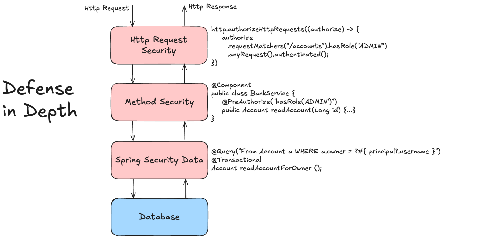

# 🧪 Enhanced Authorization Lab

## 🎯 Objective

Learn about the latest innovations in Authorization features of Spring Security.
Details on Spring Security Authorization can be found in the [Spring Security Reference Documentation](https://docs.spring.io/spring-security/reference/servlet/authorization/index.html).



---

### Step 1: Get to know the provided application

The provided application is a simple Spring Boot application that demonstrates the latest Authorization features of Spring Security.
The use case is a simple online banking application with bank accounts owned by different users.

```java
@Entity
public class BankAccount extends AbstractPersistable<Long> {
    private String owner;
    private String accountNumber;
    private BigDecimal balance;

    public BankAccount() {
    }

    public BankAccount(long id, String owner, String accountNumber, BigDecimal balance) {
        this.owner = owner;
        this.accountNumber = accountNumber;
        this.balance = balance;
    }

    public String getOwner() {
        return owner;
    }

    public String getAccountNumber() {
        return accountNumber;
    }

    public BigDecimal getBalance() {
        return balance;
    }

    // further code omitted
}
```

The application uses a simple in-memory database (H2) to store the bank accounts.
The application provides a simple REST API that allows users to create, view and update their bank accounts.

| Endpoint                | Description                                           |
|-------------------------|-------------------------------------------------------|
| GET /api/accounts       | Administrative Endpoint to get all existing accounts  |
| GET /api/accounts/{id}  | Retrieve a single account by its unique identifier    |
| POST /api/accounts      | Create a new account for currently authenticated user |
| POST /api/accounts/{id} | Increase the account balance by given amount          |

Here is the code for the REST API:

```java
@RestController
@RequestMapping("/api/accounts")
public class BankAccountApi {

    private final BankAccountService bankAccountService;

    public BankAccountApi(BankAccountService bankAccountService) {
        this.bankAccountService = bankAccountService;
    }

    @GetMapping
    List<BankAccount> findAll() {
        return bankAccountService.findAll();
    }

    @GetMapping("/{id}")
    ResponseEntity<BankAccount> findById(@PathVariable("id") long id) {
        BankAccount bankAccount = bankAccountService.findById(id);
        return bankAccount != null ? ResponseEntity.ok(bankAccount) : ResponseEntity.notFound().build();
    }

    @PostMapping
    BankAccount save(@RequestBody BankAccount toSave) {
        return bankAccountService.save(toSave);
    }

    @PostMapping("/{id}")
    ResponseEntity<String> update(@PathVariable("id") long id, @RequestBody BankAccount toUpdate) {
        boolean updated = bankAccountService.update(id, toUpdate);
        if (updated) {
            return ResponseEntity.ok().build();
        } else {
            return ResponseEntity.status(HttpStatus.FORBIDDEN.value()).build();
        }
    }
}
```

### Step 2: Get to know the authorization features

The application uses Spring Security to secure the REST API and restrict access to the endpoints based on the user's role.
This is basically done by using the `@PreAuthorize`, `@PostAuthorize` and `@AuthorizeReturnObject` annotations on the service methods.

```java
import org.example.features.security.PostReadBankAccount;
import org.example.features.security.PreGetBankAccounts;
import org.example.features.security.PreWriteBankAccount;
import org.springframework.stereotype.Service;
import org.springframework.transaction.annotation.Transactional;

import java.util.List;

@Transactional(readOnly = true)
@Service
public class BankAccountService {

    private final BankAccountRepository bankAccountRepository;

    public BankAccountService(BankAccountRepository bankAccountRepository) {
        this.bankAccountRepository = bankAccountRepository;
    }

    @PreGetBankAccounts(role = "ADMIN")
    List<BankAccount> findAll() {
        return bankAccountRepository.findAll();
    }

    @PostReadBankAccount
    BankAccount findById(long id) {
        return bankAccountRepository.findById(id).orElse(null);
    }

    @PreWriteBankAccount("#toSave")
    @Transactional
    BankAccount save(BankAccount toSave) {
        return bankAccountRepository.save(toSave);
    }

    @PreWriteBankAccount("#toUpdate")
    @Transactional
    boolean update(long id, BankAccount toUpdate) {
        return bankAccountRepository.updateBankAccount(id, toUpdate.getBalance()) == 1;
    }
}
```

The `PreGetBankAccounts` and `PreWriteBankAccount` annotations are custom security annotations that are used to restrict access to the methods based on the user's role. These are examples of the new parameterized security annotations that are introduced in Spring Security 6.3.

```java
import org.springframework.security.access.prepost.PreAuthorize;

import java.lang.annotation.ElementType;
import java.lang.annotation.Retention;
import java.lang.annotation.RetentionPolicy;
import java.lang.annotation.Target;

@Retention(RetentionPolicy.RUNTIME)
@Target(ElementType.METHOD)
@PreAuthorize("hasRole('{role}')")
public @interface PreGetBankAccounts {
    String role();
}
```

```java
import org.springframework.core.annotation.AliasFor;
import org.springframework.security.access.prepost.PreAuthorize;

import java.lang.annotation.Retention;
import java.lang.annotation.RetentionPolicy;

@Retention(RetentionPolicy.RUNTIME)
@PreAuthorize("{account}?.owner == authentication?.name")
public @interface PreWriteBankAccount {
    String value() default "#account";

    @AliasFor(attribute = "value")
    String account() default "#account";
}
```


The `PostReadBankAccount` annotation is a custom security annotation that is used to restrict access to the method based on the user's role and the returned object. This is an example of the new `@AuthorizeReturnObject` annotation that is introduced in Spring Security 6.3.

```java
import org.springframework.security.access.prepost.PostAuthorize;
import org.springframework.security.authorization.method.AuthorizeReturnObject;

import java.lang.annotation.Retention;
import java.lang.annotation.RetentionPolicy;

@Retention(RetentionPolicy.RUNTIME)
@PostAuthorize("returnObject?.owner == authentication?.name or hasRole('ACCOUNTANT')")
@AuthorizeReturnObject
public @interface PostReadBankAccount {
}
```

The `@AuthorizeReturnObject` annotation instructs Spring Security to check the returned object against the security expression. This is a new feature that is introduced in Spring Security 6.3 and allows you to restrict access to the returned object based on the user's role and the returned object's properties.

```java
import com.fasterxml.jackson.annotation.JsonIgnore;
import com.fasterxml.jackson.databind.annotation.JsonSerialize;
import jakarta.persistence.Entity;
import org.example.features.security.MaskMethodAuthorizationDeniedHandler;
import org.springframework.data.jpa.domain.AbstractPersistable;
import org.springframework.security.access.prepost.PreAuthorize;
import org.springframework.security.authorization.method.HandleAuthorizationDenied;

import java.math.BigDecimal;
import java.util.Objects;

@JsonSerialize(as = BankAccount.class)
@Entity
public class BankAccount extends AbstractPersistable<Long> {
    private String owner;
    private String accountNumber;
    private BigDecimal balance;

    // previous code omitted

    @PreAuthorize("this.owner == authentication?.name")
    @HandleAuthorizationDenied(handlerClass = MaskMethodAuthorizationDeniedHandler.class)
    public String getAccountNumber() {
        return accountNumber;
    }

    // further code omitted
}
```

Notice the `@HandleAuthorizationDenied` annotation on the `getAccountNumber()` method. This is a new feature that is introduced in Spring Security 6.3 as well and allows you to handle authorization denied exceptions in a more flexible way. The `MaskMethodAuthorizationDeniedHandler` is a custom authorization denied handler used to mask the account number if the user is not authorized to access it.

```java
import org.aopalliance.intercept.MethodInvocation;
import org.springframework.security.authorization.AuthorizationResult;
import org.springframework.security.authorization.method.MethodAuthorizationDeniedHandler;
import org.springframework.stereotype.Component;

@Component
public class MaskMethodAuthorizationDeniedHandler implements MethodAuthorizationDeniedHandler {
    @Override
    public Object handleDeniedInvocation(MethodInvocation methodInvocation, AuthorizationResult authorizationResult) {
        return "*****";
    }
}
```

### Step 3: Start the application and test the API

1. Start the application by running the `BankAccountApplication` class.
   - You can do this by right-clicking on the class and selecting **Run** or by using the command line:
   ```bash
   ./mvnw spring-boot:run
   ```

2. Use your preferred HTTP client to test the API.
    - You can use the provided HTTP client files in the `requests` folder of the module to test the API.
    - You can also use the command line to test the API using `curl` or `httpie`.